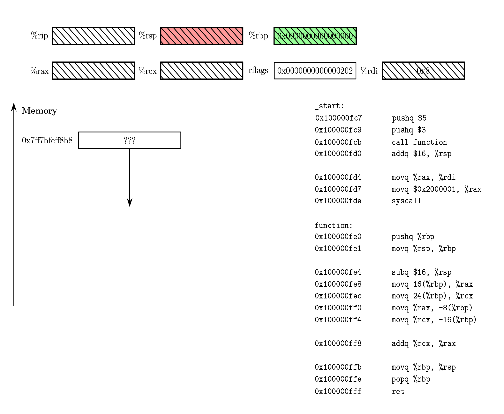

# Power function
The power function here is a rudimentary function that takes two
integer inputs, the base and the exponent and calculates the power
$a^b$. We call the function twice and then add the result together.
To explore the full stack behaviour.

While the function itself is primitive, this chapter introduces 
the concept of function calls in assembly, as well as stack management.

In modern assembly code parameters are passed to subroutines via registers.
This is much faster as access to memory is about 50-100 times slower than 
accessing a register. In the past when computers had fewer registers, e.g.
6502 has 3 general purpose registers, the stack was primarily used.
To this day, the x86_64 uses the stack for the return address but function
parameters are nowadays passed by registers. After all, you place the value
in the register, call the function and et voila everything is there.

Using the stack to pass parameters needs a little more getting used to than
passing by registers and in this chapter we will focus on that. The calling
convention using the stack is also inevitable when dealing with recursive
functions, as we'll do in the next chapter. 
In Chapter 8, we'll call a factorial functions from C making it necessary 
to use modern calling convention. We'll get into more detail there. 
<p align="center">
  
</p>
# The Stack
Every program on modern hardware "thinks" it owns all of memory. This little
power function as well as Adobe Photoshop or Google Chrome. In reality
they memory is obviously limited but the operating system handles that
for us and creates a lookup table for what is called virtual memory.
So, even though we see all of memory, not every virtual block is mapped
to real physical memory. The moment we try to access a block of memory that is
not mapped to real memory, we get the most comprehensive and accurate error
message ever devised "Segmentation fault". 

From this point on we'll just say memory.

The memory for a program is roughly divided into 3 sections. The code section,
.text where the program code lives and the data section, where
the data resigns. By design the data section is again divided into
a part called the heap and another part called the stack. As the program
owns all of RAM the stack and the heap are divided by as much space as possible.
The heap start at the bottom of memory (low memory addresses) just above the
code block and the stack starts at the top of memory and grows down. 
It's important to point out that the stack being on top and growing down is
purely a design decision. In a way memory was there first, and the stack came
later. Nevertheless, this can lead to confusion and you should have a picture
like ref HERE in mind. 
## Stack calling convention
The gist of the stack calling convention is this:
 - We push the values in reverse order onto the stack. Using the 
   reverse order is just a convention to comply with the old C calling convention. 
   Do what you want!
 - We branch using the call instruction.
 - The call instruction pushes the return address, that is the address
   of the instruction directly after the call instruction onto the stack
   and then changes the instruction pointer (IP) to the label address.  
 - By convention, we push the base pointer onto the stack
 - We then point the base pointer at the same address as the stack pointer.
   Essentially, remembering what rsp was when we entered the function.
 - Next we do what the function needs to do
 - At the end we restore rsp with the help of rbp. So, whatever we did
   after this the stack pointer will be the same as when we entered the function.
 - Finally we pop of the old base pointer, restoring it to the value it was
   before we called the function. Remember, the popq instruction uses rsp.
   pop simply returns the value at the address of rsp. If rsp is not properly
   adjusted we would get the wrong value.
 - Finally, we use the ret instruction to return to the address. ret copies the address rsp 
   is pointing to into the IP. If you forget to pop rbp and rsp is still pointing at it. 
   ret will copy that value into rip and explore that address. 
## The Stack ain't no Stack

## Stack Frame
You will often hear the term stack frame. The stack frame is basically the currently
active scope of the function; starting at the base pointer and ending at the current
stack pointer. All variables within the current stack frame are said to be in scope.
Obviously that's kind of nonsense, as we just pulled down the variables from callers 
stack frame and moved them into our registers. Like the stack, stack frame is software
design choice, supported by the hardware than a concept required by the  hardware.

## Context insensitive Code
I just want to mention that when we call the power function in this example, we immediately
use the base and the exponent. If we're dealing with more complex code or were to write a compiler
a very standard way to handle things is to create what's called context insensitive code. 
What it basically means is, we would first make space on the local stack frame and immediately
store every variable on the local stack frame. We then can break down every instruction into
Load, ALU, Store idiom. That becomes also very useful the moment you write bigger functions and are 
running out of registers or just start to lose track. 
Every compiler without optimizations, will translate the code to into context insensitive assembly
int debugging mode or with optimizations turned off. After the context insensitive code is created
the optimizer will then get rid of unnecessary operations. A simple but  striking example for that 
is a generic swap function. 
## Modern calling convention
As mentioned before on modern systems the first 6 elements in x86_64 are passed
by registers. Those six registers are, in order
|Argument | Register|
-------------------
|  1st    |  %rdi   |
|  2nd    |  %rsi   |
|  3rd    |  %rdx   |
|  4th    |  %rcx   |
|  5th    |  %r8    |
|  6th    |  %r9    |

Please note, I didn't have a class of wine when composing this list. 
Unlike the people creating it. On a more serious note, there are obviously legacy reasons 
for this obscure convention. Wait, is that an empty bottle of Jack Daniels? 

We'll go into more detail in Chapter 8, when interacting with C. 
Every, register that passes a function argument is considered volatile from the
callers perspective. Additionally, obviously rax as it will hold the return value
and r10 and r11.
 


DRP, Don't repeat yourself is a fundamental concept in programming.
Once understood that the CPU just executes one instruction at a time
with the occasional branch, we quickly realize that we often need
to do the same thing
[^1]: 
Reverse order, because it's the C convention
```
extern int power(int base, int exponent);
```
With this prototype, we would first push base onto the stack
