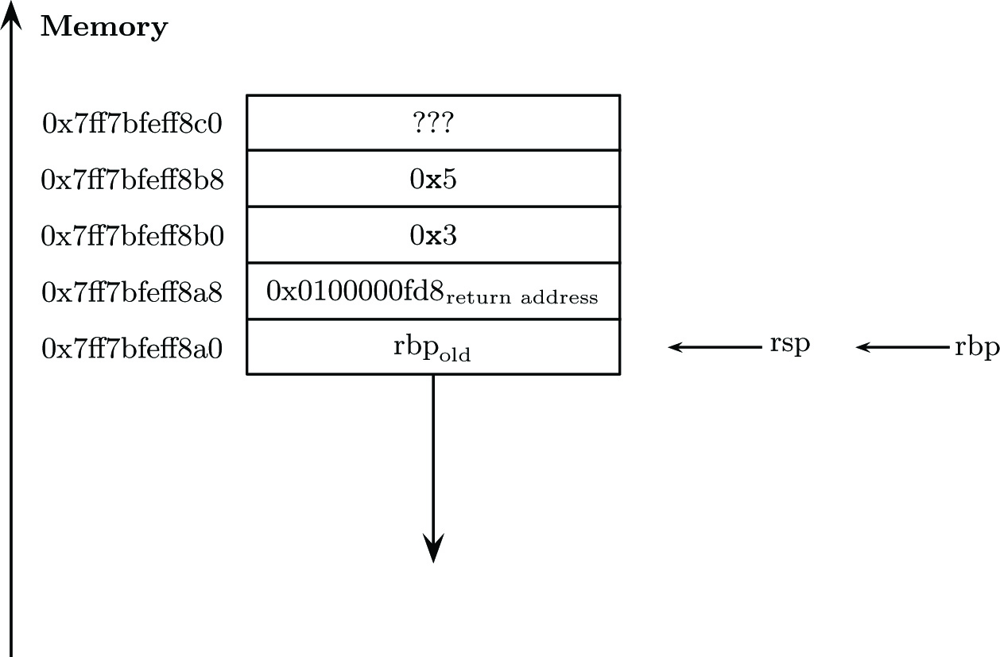

# Power function
The power function here is a rudimentary function that takes two
integer inputs, the base and the exponent and calculates the power
$a^b$. While the function itself is primitive, this chapter introduces 
the concept of function calls in assembly, as well as the stack management.

In modern assembly code parameters are passed to the subroutine via registers.
This is much faster as access to memory is about 50-100 times slower than 
accessing a register. In the past when computers had fewer registers, e.g.
6502 has 3 general purpose registers, the stack was primarily used.
To this day, the x86_64 uses the stack for the return address but function
parameters are nowadays passed by registers. After all, you place the value
in the register, call the function and et voila everything is there.

Using the stack to pass parameters needs a little more getting used to than
passing by registers and in this chapter we will focus on that. The calling
convention using the stack is also inevitable when dealing with recursive
functions, as we'll do in the next chapter. 
In Chapter 8, we'll call a factorial functions from C making making it
necessary to use modern calling convention. We'll get into more detail
there. 

# The stack
Every program on modern hardware thinks it owns all of memory. This little
power function as well as Adobe Photoshop or Google Chrome. In reality
they memory is obviously limited but the operating system handles that
for us and creates a lookup table for what is called virtual memory.
So, event though we see all of memory, not everything virtual block is mapped
to real physical memory. The moment we try to access a block of memory that is
not mapped to real memory, we get the most comprehensive and accurate error
message ever devised "Segmention fault". 

From this point on we'll just say memory.

The memory for a program is roughly divided into 3 sections. The code section,
.text where the program code lives and the data section, where
the data resigns. By design the data section is again divided into
a part called the heap and another part called the stack. As the program
owns all of RAM the stack and the heap are divided by as much space as possible.
The heap start at the bottom of memory (low memory addresses) just above the
code block and the stack starts at the top of memory and grows down. 
It's important to point out that the stack being on top and growing down is
purely a design decision. In a way memory was there first, and the stack came
later. Nevertheless, this can lead to confusion and you should have a picture
like ref HERE in mind. 

## Stack calling convention

 

DRP, Don't repeat yourself is a fundamental concept in programming.
Once understood that the CPU just executes one instruction at a time
with the occasional branch, we quickly realize that we often need
to do the same thing

