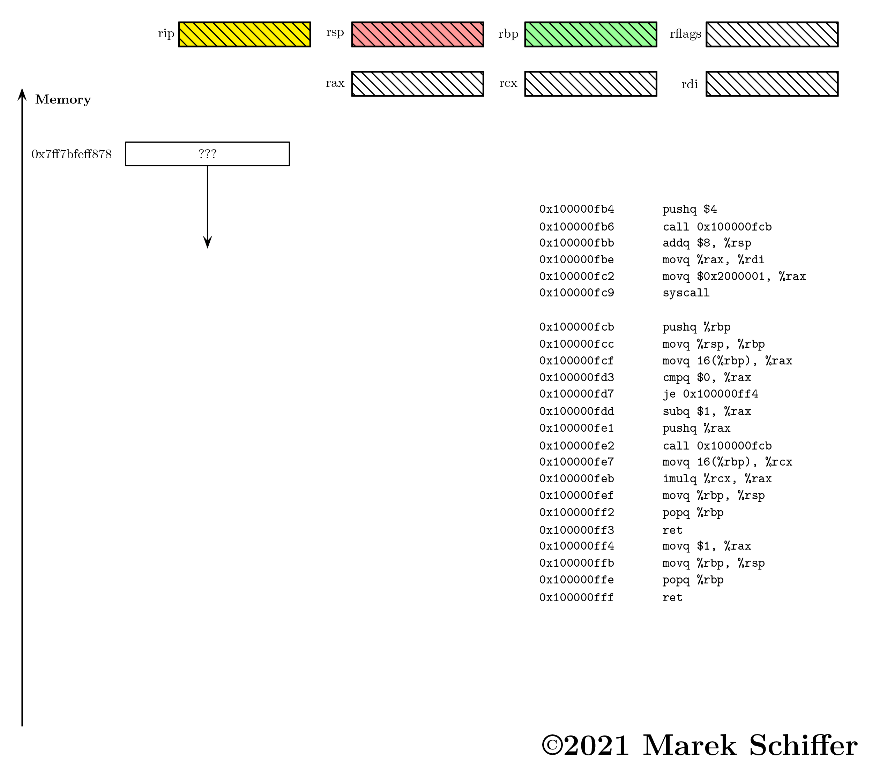

  

  

    <figcaption>Figure 1: Factorial. </figcaption>
  

      

# Factorial
If somebody asks you what 720! is, you can always answer. It's obviously
$720 * 719!$ The questioner might argue that doesn't help much and ask what 719! is.
To which you reply: «It's $719 * 718!$» If he's still not satisfied, I suggest 
you put him in his place and tell him to do some work on his own.  

The gist is the factorial function can be solved recursively. The solution can be
postponed up until the point the recursion anchor or base case is reached.

For factorial, the anchor is **$0! = 1$**. All other cases are resolved with **$n! = n * (n-1)!$**

## Recursion
Now, let's take the case 720! and solve it recursively purely mathematically.
Actually, let's take $4!$ and leave the $720!$ as an exercise for the reader.

$$
\begin{align}
4! & = 4 * 3! \\
   & = 4 * ( 3 * 2! ) \\
   & = 4 * ( 3 * ( 2 * 1! )) \\
   & = 4 * ( 3 * ( 2 * ( 1 * 0! )) \\
   & = 4 * ( 3 * ( 2 * ( 1 * ( 1 ))) \\
   & = 4 * ( 3 * ( 2 * ( 1 * 1 )) \\
   & = 4 * ( 3 * ( 2 * 1 )) \\
   & = 4 * ( 3 * 2 ) \\
   & = 4 * 6  \\
   & = 24  \\
\end{align}
$$

The Parentheses are not necessary in this example as multiplication commutes and left associative is 
the same as right associative. They're left in to make clear how the expression is evaluated.
As you can see the recursion pushes the expression back up until there is no other option. 
After the full expansion of the expression, the expression is evaluated inside out.  

It's like a whip. It fully expands and then it recoils back.  

These principals are not unique to the factorial function, which is the simplest example of tail-recursion.

## Recursion in assembly
The beauty of doing recursion in assembly is that it strips away all the high level magic. 
__Just call the function again, Duh!__. In the previous example we already dissected how function calls
work via stack. The thing to remember is,
  * The function returns to the next instruction after the call/bl opcode. 
### $0!$ Base case vs. $1!$ Base case
I choose, $0!$ as the base case. In traditional recursion, that's not really necessary and most standard
examples use $1!$ as the base case. After all $$1! = 1 * 0! = 1 * 1 = 1$$.
By traditional recursion I mean no analytical continuation via Gamma Function, limiting the factorial to $n \geq 0$
Without analytical continuation $0! = 1$ expansion is mostly used in series like

$$
  \sum_{k=0}^{\infty} \frac{x^k}{k!}
$$
