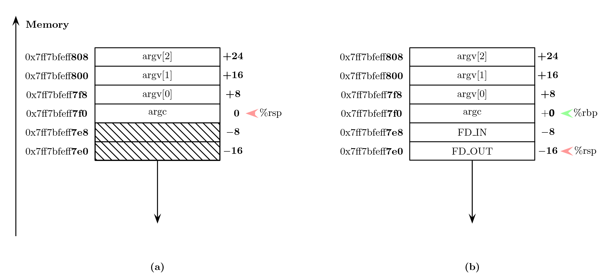

<div align="center">
  

  <div align="center">
    <figcaption> Figure 1: Passing of external arguemts via Stack (2023) </figcaption>
  </div>
  <br> <br>
</div>
# Introduction
The basic premise of this chapter is to write a program that
takes an input file A  and creates and output file B, where every letter 
in B is capitalized. Therefore "toUpper".  

This chapter goes deeper into syscalls and shows how high up the stack we still are.
The second lesson of this chapter is to expand the calling convention so that an external
File can be passed to the program. This is the analogon to 
```c
int main(int argc, char **argv) {
```
Here argc is the argument count and argv is the argument vector(?), which is an array
holding the address to the passed in files. The body of work is again done by the operating
system.

## syscalls
| Return Value %rax   | System Call    | %rax       | %rdi            | %rsi               | %rdx                 |
|---------------------|----------------|------------|-----------------|--------------------|----------------------|
|                     | Exit           | 0x2000001  | Exit Code       |                    |                      |
| File Descriptor     | Open File      | 0x2000005  | File Path       | File Status Flag   | File Descriptor Flag |
|                     | Close File     | 0x2000006  | File Descriptor |                    |                      |
| Bytes Read          | Read File      | 0x2000003  | File Descriptor | Buffer Location    | Buffer Size          |
|                     | Write File     | 0x2000004  | File Descriptor | Buffer Location    | Buffer Size          |


Additionally to the exit syscall we've been using, we need four new syscall. One to open
a file, one to close the file again, one to read from a file and one to write to a file.

### Files in UNIX
BSD is a UNIX derivative and macOS is a BSD derivative. At it's core macOS is a UNIX sytem.
That's what makes it useful. \#ShotsFired!  

### File Descriptor Flags
Files on UNIX have permissions. Every file can be read, written to or it can be executed.
The files also have ownership. They can belong to the user, a group, or everyone. 
All three permissions are stored in an octal value, where read is 4, write is 2
and execute is 1. Therefore the shell command 
```
chmod 0644 ./toUpper
```
would allow the owner, first digit after the leading 0, to read and write, since
$6 = 4 + 2$. The group, second digit after leading 0, has permission to read and the last
digit allows everyone to read as well. The leading zero indicates that this is an octal number
$\in [0,7]$.

In the same way 
```
chmod 0711 ./toUpper
```
would allow the owner to read, write and execute the program $7 = 4 + 2 + 1$, while everybody else can just execute it.

### File Status Flags
The permissions outlined File Descriptor Falgs above are valid for files outside of the program. 
Additionally, we need to specify the permissions within the program. Are we allowed to write to the file? 
Do we overwrite it, if it already exists? Do we append to it, if it already exists? All this can be 
specified and is another input to the syscall. These permissions are called **File Status Flags** and are 
typically given in hexadecimal.  The Flag names are standardized and prefixed with O\_ for **O**pen.
The ones, we'll need are:

| Flag       | Hex Value | Description                                      |
|------------|-----------|--------------------------------------------------|
| O_RDONLY   | 0x0       | Open file **R**ead **Only**.                     |
| O_WRONLY   | 0x1       | Open file **Wr**ite **Only**.                    |
| O_RDWR     | 0x2       | Open file **R**ea**d** and **Wr**iting.          |
| O_APPEND   | 0x8       | **Append** to file                               |
| O_CREAT    | 0x200     | **Creat**e file if it doesn't exist              |
| O_TRUNC    | 0x400     | **Trunc**ate file to zero length if it exists    |

You might ask, why O\_CREAT is missing an e at the end. Imagine me staring at
you like George Washington in the famous SNL skit and responding "Nobody knows!"

To open a file in **W**rite**Only** mode, **c**reate it, if it doesn't exit and
**trunc**ate it, if it already exists, we would use $\text{0x601} = \text{0x400} + \text{0x200} + \text{0x001}$.

### File Descriptors
The next pesky little thing we need to deal with are File Descriptors. If we ask the operating system
to open the file, it will do it and return a file descriptor to us. That number can then be passed back
to the os to write to the file. The operating system behind the scenes loads the file into memory, 
then changes it and uses the filesystem to write it to disk. As we operate in userspace, we need to
use the file descriptor to specify the files. The syscalls read and write need the file descriptor as 
input.  

### Reading and Writing to a file
Reading from a file means loading it into memory, that we own. That is typically called a buffer. We'll
therefore declare a buffer in memory and pass it to the syscall. The syscall will read from the file
and place the bytes into our buffer. The syscall also needs the buffer size as input and then  
**the syscall will internally remember the position within the file**. This is typcially called the 
file offset. In other words, if we call read twice on the same inputfile it will start from where it left 
off the last time. We don't need to track that. The operating system does that for us. It's at this moment 
that you should feel the urge to write an operating system yourself. The layers of abstraction compound.

